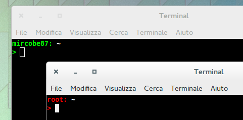

# Prompt Personalizzati #

## Files ##
 - **`set-prompts.sh`** Lo script bash che modifica i prompts
 - **`README`** Questo file di testo.

## Esecuzione ##
 Controllare i diritti per l'esecuzione prima di eseguire. Eseguire con sudo!!!

## Esempio ##
 Lo script modifica il prompt di root e dell'user che lo esegue.
 Il risultato è un prompt del genere:
 